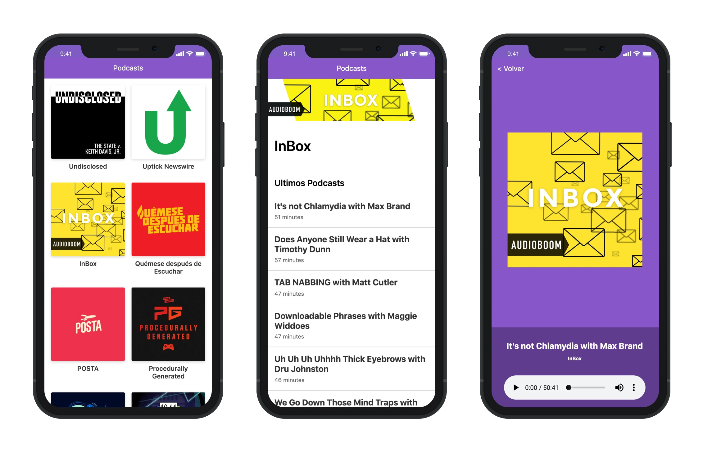

# App de Podcasts

App de Podcasts integrada con la API de AudioBoom usando NextJS

[Ver la aplicación](https://podcast.luisdiazvenero.now.sh/)

## Cómo funciona

Requiere NodeJS 10

* `npm install` para instalar las dependencias.
* `npm run dev` para el entorno de desarrollo.
* `npm run build && npm start` para el entorno de producción.

## Licencia

MIT